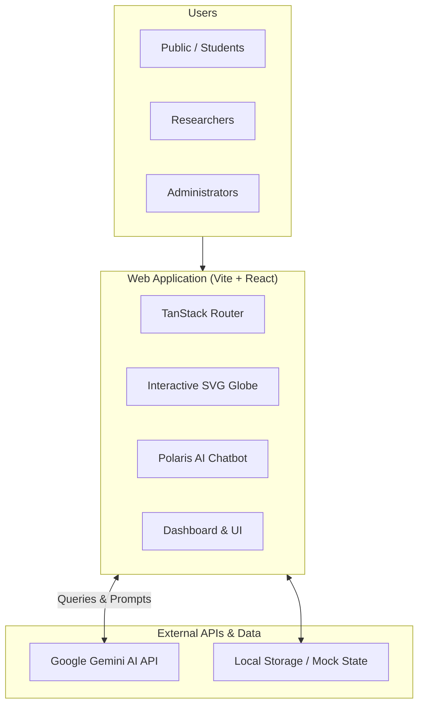

<div align="center">

# 🧊 PolaRis

### A Unified Digital Ecosystem for India's Polar Science Outreach, Research & Media

**Smart India Hackathon 2026 · SIH26063**
**Proposed by:** Ministry of Earth Sciences (MoES), Government of India

[](https://react.dev/)
[](https://vitejs.dev/)
[](https://www.typescriptlang.org/)
[](https://tailwindcss.com/)
[](https://deepmind.google/technologies/gemini/)

</div>

---

## 🌍 Overview

The **PolaRis** connects India's polar science research, public outreach, and multimedia dissemination into a single accessible platform. It brings together India's expeditions to **Antarctica, the Arctic, and the Himalayas** — making cutting-edge climate and ecology research discoverable to researchers, students, educators, and the public.

---

## 🎯 Core Objectives

| Pillar | Purpose | Highlights |
|---|---|---|
| 🌐 **Outreach** | Educate the public & students on India's polar expeditions | Interactive SVG globe, station maps, AI Chatbot assistant |
| 📚 **Knowledge Repository** | Centralized searchable research database | Thematic datasets, expedition metrics, gamified learning |
| 🎥 **Media Dissemination** | Organize and stream polar multimedia | High-resolution image galleries, expedition logs, PDFs |

---

## ✨ Key Features

- 🌎 **Interactive Polar Globe** — Drag, rotate, and zoom into research stations (Bharati, Maitri, Himadri) via a custom orthographic projection.
- 🤖 **Polaris AI Chatbot** — Integrated Gemini 3.6 Flash assistant capable of answering complex queries about Indian polar expeditions and climate data.
- 📊 **Responsive Dashboard** — A premium glassmorphic UI for tracking user metrics, recent access requests, and active research items.
- 🎓 **Learning Modules** — Structured lessons covering research pillars from ice-sheet mass balance to Southern Ocean carbon accounting.
- 🖼️ **Dynamic Media Library** — Filterable gallery containing verified field photography and official scientific reports.
- ♿ **Accessible & Responsive** — Built mobile-first with Tailwind CSS, supporting dark/light themes and full screen-reader compatibility.

---

## 🏗️ Architecture



---

## 🧰 Tech Stack

| Layer | Technology | Why |
|---|---|---|
| **Frontend** | React + Vite | Lightning-fast HMR and optimized production builds |
| **Routing** | TanStack Router | Fully type-safe routing with excellent data loading |
| **Styling** | Tailwind CSS + Shadcn UI | Rapid, accessible, and responsive component design |
| **Icons** | Lucide React | Clean, consistent, and lightweight vector icons |
| **AI Assistant** | Google Gemini SDK | High-performance reasoning for the Polaris Chatbot |
| **Data Layer** | TanStack Query | Caching, synchronization, and state management |

---

## 📁 Page Structure

```
/                       → Homepage with interactive globe & mission overview
/dashboard              → User dashboard with premium glassmorphic UI
/expeditions            → Expedition listings & season-by-season objectives
/repository             → Knowledge repository search & datasets
/learning               → Learning modules & curriculum
/media                  → High-resolution media library & PDF reports
/auth                   → Sign in & authentication flow
/admin                  → Admin console routing
```

---

## ⚙️ Getting Started

### Prerequisites
- Node.js ≥ 18
- Gemini API Key (for the Polaris AI Chatbot)

### Installation

```bash
# Clone the repository
git clone https://github.com/<your-org>/polar-science-portal.git
cd polar-science-portal

# Install dependencies
npm install

# Setup Environment Variables
cp .env.example .env
# Edit .env and add your VITE_GEMINI_API_KEY

# Start the development server
npm run dev
```

The app will be available at **http://localhost:5173**

### Environment Variables

```env
VITE_GEMINI_API_KEY=your_gemini_api_key_here
```

---

## 🗂️ Project Structure

```
polaris-gateway/
├── public/                 # Static assets (Favicons, PDFs)
├── scripts/                # Utility scripts (e.g., PDF generation)
├── src/
│   ├── components/         # Reusable UI (Globe, Shell, Shadcn)
│   ├── features/           # Domain logic (AI, Auth, Media, Site Content)
│   ├── lib/                # Utilities & configurations
│   ├── routes/             # TanStack Router page components
│   ├── routeTree.gen.ts    # Auto-generated routing tree
│   └── styles.css          # Global Tailwind directives
├── index.html              # Vite entry point
├── vite.config.ts          # Vite configuration
└── package.json            # Dependencies & scripts
```

---

## 🚧 Roadmap for SIH 2026 Finale

- [ ] **Backend Migration:** Transition from local state to a FastAPI / PostgreSQL backend.
- [ ] **Live Telemetry:** Integrate real-time weather and sensor data from Antarctic stations.
- [ ] **Advanced RAG:** Enhance the Polaris AI to search directly within uploaded research PDFs.
- [ ] **Role-Based Auth:** Implement full JWT authentication for Admin/Researcher roles.

---

## 🤝 Contributing

Contributions are welcome! 

1. Fork the repository
2. Create your feature branch (`git checkout -b feature/amazing-feature`)
3. Commit your changes (`git commit -m 'Add amazing feature'`)
4. Push to the branch (`git push origin feature/amazing-feature`)
5. Open a Pull Request

---

## 📄 License

This project is licensed under the **MIT License** — see the [LICENSE](./LICENSE) file for details.

---

<div align="center">

**Built for Smart India Hackathon 2026** · Ministry of Earth Sciences 🇮🇳

</div>
